# Examples

Examples directory structure:
```plain
examples
├── dataset_preprocess
│   ├── ucr_prepr.py
│   ├── README.md
├── sample_configs
│   ├── experiments
│   │   ├── alpha.yaml
│   │   ├── alpha_test.yaml
│   │   ├── amex_bananas.yaml
│   │   ├── ...
│   ├── env.yaml
│   ├── hpo_config.yaml
│   ├── bananas.yaml
│   ├── README.md
```

- `dataset_preprocess` directory contains scripts for dataset preprocessing to the appropriate format for *webdataset*.
- `sample_configs` directory contains default config examples.

# Quick Start

Main NAS pipeline is shown below.



1. The first script `search.py` searches the best architecture. The next NAS methods are supported:
   1. Random Search
   2. Bananas
   3. Hyperband
   4. DiffNas
   5. Pertrubation
   **The first 3 are recommended to use. The last 2 are experimental.**
   After script finishes Searcher results directory will be dumped. It contains logs and directory with computed architectures (*arches*).
2. The second script `train_final.py` does hyperparameter optimization. It takes results after search method and Optuna config. After script finishes HPO results directory will be dumped. It contains logs and directory with best weights (*checkpoints*).
3. The third script `eval_*.py` makes evaluation on test data. If you split data into train/val/test yourself you have to use  `eval_local_test.py`. It prints score on local test. <br/>
If you have test data and split data only into train/val you have to write your own evaluation script for submission generation. There is example that currently works **only for amex** competition `eval_kaggle.py`

## Amex example

Download [Amex dataset](https://www.kaggle.com/datasets/raddar/amex-data-integer-dtypes-parquet-format?select=train.parquet). Create `/data/amex` directory and move *train.parquet* and *test.parquet* to it. This dataset is already in necessary format for *webdataset*, that's why there is no need for preprocessing.<br/>
If you need to preprocess dataset for *webdataset* usage see [examples/dataset_preprocess/README.md](dataset_preprocess/README.md).<br/>
In the following examples we use default experiment and environment configs. If you want to change/create configs see [examples/sample_configs/README.md](sample_configs/README.md)

## Search phase

Go to the root repository directory

```shell
cd /home/dev
```

Main parameters for search scripts are described in the table below:

| Parameter          | Type | Description                                 |
|:-------------------|:-----|:--------------------------------------------|
| `worker_count`     | int  | number of dataloader workers per single gpu |
| `gpu_num`     | str  | number of gpus on which computation is made |


Notice that when you launch first time *webdataset* module will prepare your dataset for training. Prepared data will be saved in `/data/amex/data_web`.
<br/>If you want to regenerate data you have to delete this folder and run script again.


### Random Search

```shell
python -m SeqNAS search --env_cfg examples/sample_configs/env.yaml --exp_cfg examples/sample_configs/experiment/amex_random.yaml --worker_count=2 --gpu_num=0,1
```

### Bananas

```shell
python -m SeqNAS search --env_cfg examples/sample_configs/env.yaml --exp_cfg examples/sample_configs/experiment/amex_bananas.yaml --worker_count=2 --gpu_num=0,1
```

Bananas uses an additional config that should be listen in the search optimizer params in the experiment config.

### Hyperband

```shell
python -m SeqNAS search --env_cfg examples/sample_configs/env.yaml --exp_cfg examples/sample_configs/experiment/amex_hyperband.yaml --worker_count=2 --gpu_num=0,1
```

### DiffNas

```shell
python -m SeqNAS search --env_cfg examples/sample_configs/env.yaml --exp_cfg examples/sample_configs/experiment/amex_diffnas.yaml --worker_count=2 --gpu_num=0,1
```

### Pertrubation

```shell
python -m SeqNAS search --env_cfg examples/sample_configs/env.yaml --exp_cfg examples/sample_configs/experiment/amex_ptb.yaml --worker_count=2 --gpu_num=0,1
```

## HPO phase

Example of HPO after search is shown below.

```shell
python -m SeqNAS hpo --experiment_path=searcher/results/folder --hpo_cfg examples/sample_configs/hpo_config.yaml --train_top_k=1 --n_trials=10 --worker_count=2 --gpu_num=0,1 --env_cfg examples/sample_configs/env.yaml
```

| Parameter          | Type | Description                         |
|:-------------------|:-----|:------------------------------------|
| `experiment_path`  | str  | path to searcher results directory  |
| `hpo_cfg`  | str  | path to optuna config  |
| `train_top_k`     | int  | for k arches HPO is conducted       |
| `n_trials`     | int  | number of HPO trials per single gpu |

`experiment_path` by default has the following structure `experiments/experiment_name/searcher_name/model_name/xxxx-xx-xx_xx:xx:xx` <br/>
In tne example above path can be `experiments/amex_random/RandomSearcher/FlexibleTransformer/2023-01-23_11:49:38`

## Evaluation phase

```shell
python -m SeqNAS eval_kaggle --experiment_path=hpo/results/folder --worker_count=2 --gpu_num=0
```

`experiment_path` by default has the following structure `experiments/experiment_name/train_final/model_name/xxxx-xx-xx_xx:xx:xx` <br/>
In tne example above path can be `experiments/amex_random/train_final/FlexibleTransformer/2023-01-23_13:22:33/` <br/>
Notice that `gpu_num` parameter here can be only single value.

When script finishes `submissions` folder will be generated in `experiment_path`.

## UCR (InsectSound/ElectricDevices) example.

Download and preprocess datasets:

```shell
cd /home/dev
wget https://timeseriesclassification.com/Downloads/ElectricDevices.zip
python examples/dataset_preprocess/ucr_prepr.py --ucr_zip=ElectricDevices.zip --save_folder=/data/ElectricDevices
rm ElectricDevices.zip
```

```shell
wget https://timeseriesclassification.com/Downloads/InsectSound.zip
python examples/dataset_preprocess/ucr_prepr.py --ucr_zip=InsectSound.zip --save_folder=/data/InsectSound
rm InsectSound.zip
```

Run experiments:

```shell
python -m SeqNAS search --env_cfg examples/sample_configs/env.yaml --exp_cfg examples/sample_configs/experiment/ElectricDevices.yaml --worker_count=1 --gpu_num=0,1
```

```shell
python -m SeqNAS search --env_cfg examples/sample_configs/env.yaml --exp_cfg examples/sample_configs/experiment/InsectSound.yaml --worker_count=1 --gpu_num=0,1
```

Run HPO

```shell
python -m SeqNAS hpo --experiment_path=searcher/results/folder --hpo_cfg examples/sample_configs/hpo_config.yaml --train_top_k=1 --n_trials=10 --worker_count=1 --gpu_num=0,1
```

Run Evaluation

```shell
python -m SeqNAS eval_local_test --experiment_path=hpo/results/folder --worker_count=1 --gpu_num=0
```
